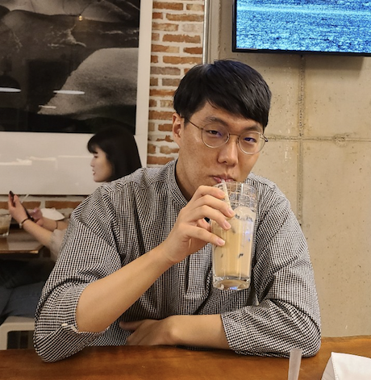

<h1 align="center">
   
  
</h1>

<h4 align="center">KU Study Group</h4>

NLP & AI, Korea University

    
    
    
    

> "Out of 311" is sub study group of [KU NMT](https://kunmt.org). NMT (Neural Machine Translation) is advanced artificial intelligence research. Many new intern researchers have difficulty with basic knowledge of NLP.

> This study group was created under the slogan **"What you understand should be able to explain."** We write and study all learning that occurs outside of lab 311.

## Rules

1. Be(非) Professional

2. To Be Programmable

   Good is the work process

3. Bottom-up

   Our research domain is almost advanced and further way from ML/DL basics.

4. Do not Be Shy

   We love TTL (Too Much Talker). More Personal, More involved

5. Do lot of mistakes

   We love errors. We are still young, so we have to face many difficulties.

## Reason Why to Study

1. Be Prepare

   To capture the chance that go further your research.

2. To know the flow of AI algorithms

   Not only acquire the details of  how work algorithms or papers, But also we must know why these algorithms came out and where came from.

## What we studied

## Members

Lee SeungJun | Kang Myunghoon | Koo Sunmin
---------|----------|---------
  |  | 
 PM | N/A | N/A

